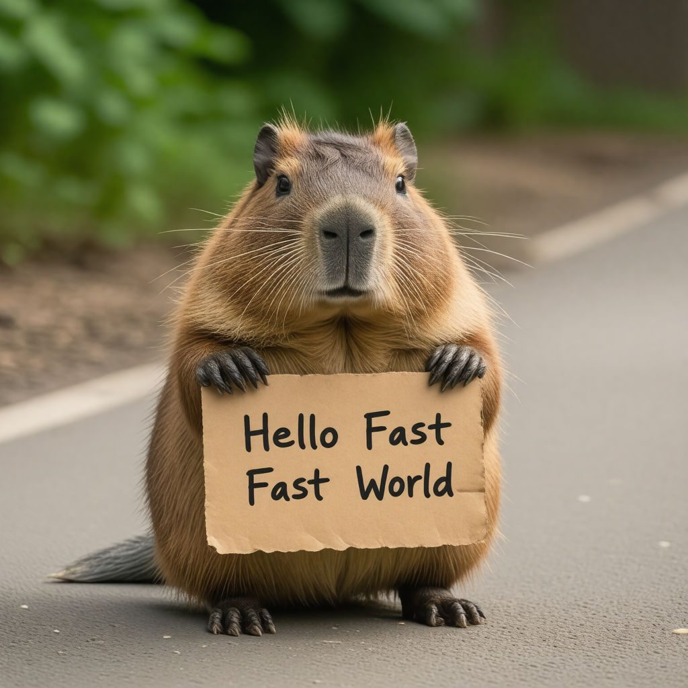
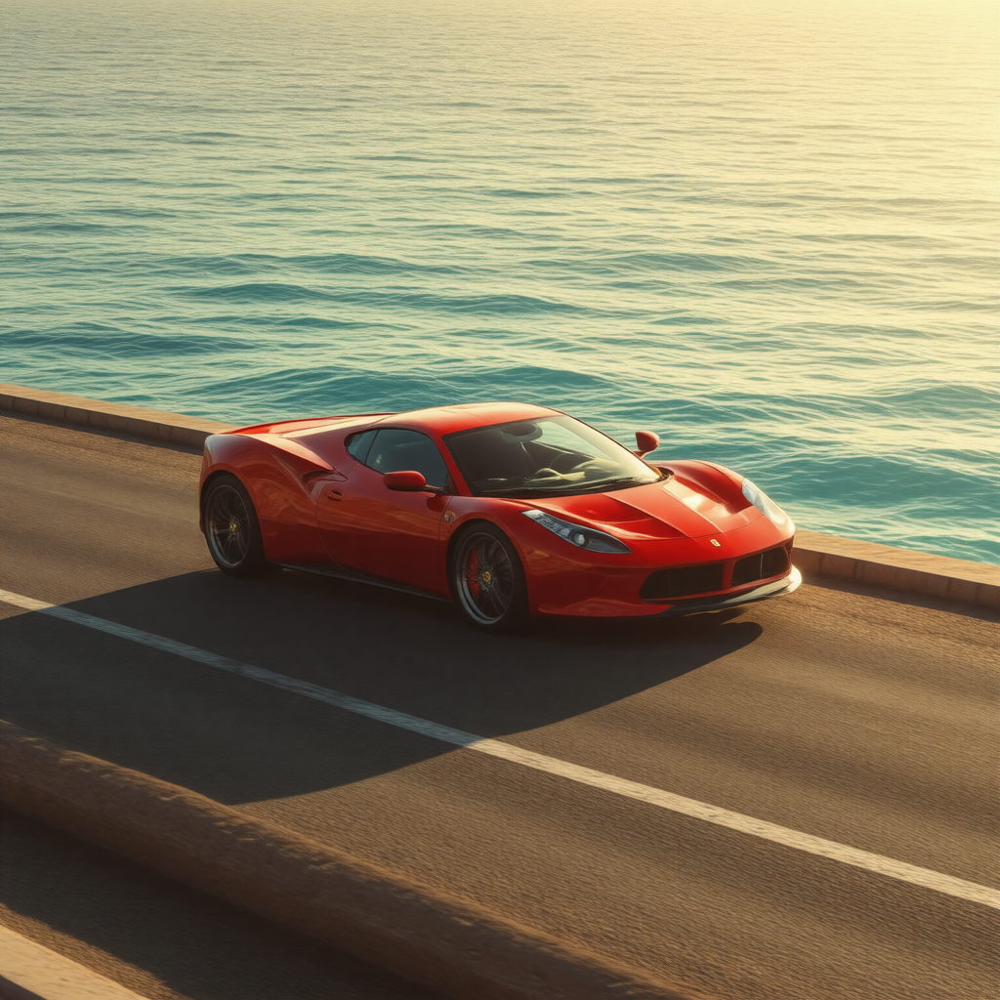

# Text-to-Image model evaluation

## Introduction

> Evaluate multiple open source models for text-to-image

### Equipment configuration

1. Platform: Windows 11
2. CPU: AMD Ryzen 7 5800H with Radeon Graphics
3. Internal memory: 16GiB
4. GPU: NVIDIA GeForce RTX 3060 Laptop
5. Video memory: 6GiB

#### SD3.5 Large Turbo

Prompt: A capybara holding a sign that reads 'Hello Fast World'.

---

Prompt: 一只水豚举着一个牌子，上面写着：你好，世界。

---

Prompt: A red sports car was driving in the sun by the sea.

---

Prompt: 一辆红色的跑车在海边的阳光下行驶。

